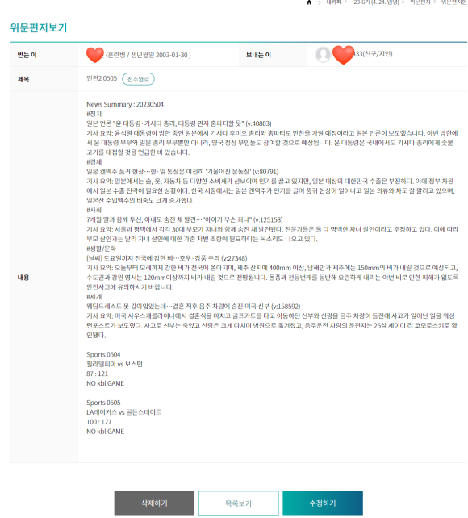

# auto-army-letter

### 인편 자동화 프로그램 (2023.05.05)

최신 뉴스와 스포츠 결과 등을 종합하여 지정된 시간에 더캠프 인터넷 편지를 보내는 프로그램



### 주요 기능

- 하루에 한번 지정된 시간에 theCamp api로 인편 발송
- beautifulsoup를 사용하여 네이버 뉴스에서 분야별로 그날의 인기 뉴스를 크롤링
- chat gpt를 사용하여 뉴스 내용 요약
- 네이버 스포츠에서 스포츠 경기 결과, 네이버 날씨에서 날씨 정보를 추출
- 내용을 모아서 인편으로 발송, 로그에 저장


### 배운 점

- api에 대한 개념과 api를 활용하여 유용한 프로그램 만들어보기
- aws ec2로 서버 환경을 구성하기
- 뉴스 사이트 등 웹 크롤링하여 필요한 정보 얻기
- chat gpt api 활용하기


### 사용 방법

- 개인 실행 환경에 리포지토리를 클론한다 (개인적으로는 aws ec2인스턴스 활용)
``` bash
git clone https://github.com/linklingj/auto-army-letter.git
```
- beautifulsoup4를 설치한다
``` bash
pip install beautifulsoup4
```
- 루트에 credential.py 파일을 만들어 theCamp이메일, 비번, 훈련병 이름을 user_id, user_pw, soldier_name에 저장한다
``` python
user_id = ""
user_pw = ""
soldier_name = ""
```
- summarize_text.py에 openai api키를 넣는다
``` python
openai.api_key = ""
```
- app.py를 실행한다
``` bash
python app.py
```

### 참고

- 블로그 포스팅: https://blog.naver.com/jaehyun_choi/223094237602
- 참고 레포: https://github.com/SyphonArch/news-relay
- 더캠프 라이브러리: https://github.com/lewisleedev/thecampy